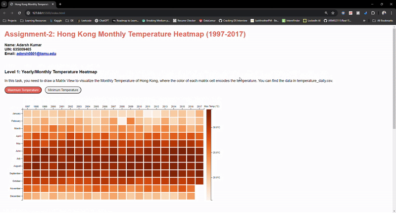

# Hong Kong Monthly Temperature Visualization 

This repository is for CSCE-679 Data Visualization - Assignment-2 for Spring 2025.

---

## Author
- [@Adarsh Kumar](https://github.com/adarsh-k-tiwari/)

---
## Demo


---
## Folder Structure

```
.CSCE679-DataViz/
   |-- index.html                  # Base HTML code for structure of page
   |-- index.css                   # Base CSS code for styling
   |-- level1.js                   # File for D3.js container for Level 1
   |-- level2.js                   # File for D3.js container for Level 2
   |-- temperature_daily.csv       # CSV fle for temperature data
   |-- demo.gif                    # Demo of Vis
   |-- README.md                   # Project documentation (this file)
   |-- LICENSE                     # Project's MIT License
```

---

## Installation (Locally)

1. Clone this repository:
   ```bash
   git clone <repository_url>
   cd CSCE679-DataViz
   ```

2. Open the index.html file in a live server
---

## License

This project is licensed under the MIT License. See the `LICENSE` file for details.

---

## Acknowledgments

- [Xia Meng](https://github.com/xiameng552180/CSCE-679-Data-Visualization-Assignment2)